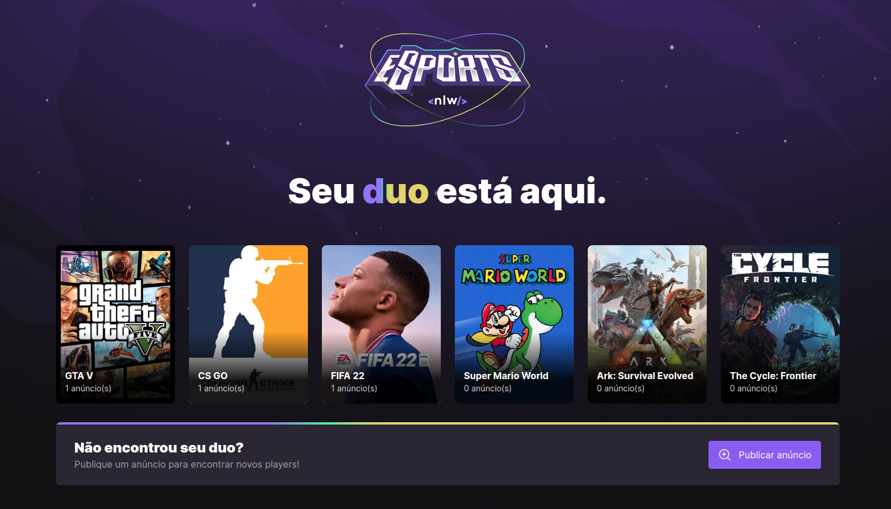

  

An application for you to make new friends and play together. Developed in a @Rocketseat bootcamp.

<h2> :book: About</h2>

The project has an app made with react native and expo to show the ads and see the players' discord. The backend was created using Prisma and Express with two tables for ads and games. The frontend was created with Vite and Tailwind with Radix, it allows users to publish your ads.